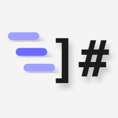

  <a href="https://mdify-app.vercel.app">
    <picture>
      <source media="(prefers-color-scheme: dark)" srcset="frontend/public/mdify-icon-dark.svg">
      
    </picture>
  </a>

<h1 align="center">MDify: Free PDF to Markdown Converter</h1>

  <strong>Turn PDF, Word, PowerPoint, Excel, HTML, images and ZIP files into clean Markdown.</strong> 
  Cut PDF token costs by 70% and make your free AI plan go further.

  <a href="https://mdify-app.vercel.app"><strong>Open MDify</strong></a>
  &nbsp;·&nbsp;
  <a href="https://mdify-app.vercel.app/usecase">Why Markdown</a>
  &nbsp;·&nbsp;
  <a href="#faq">FAQ</a>
  &nbsp;·&nbsp;
  <a href="https://mdify-app.vercel.app/privacy">Privacy</a>

  
  
  
  

**TL;DR:** MDify is a free web app that converts documents, images and ZIP files into Markdown, with no account. An AI chat app that reads a PDF page as text plus a picture of the page spends about 2,235 tokens on a 500-word page. The same page as Markdown costs about 667 tokens, 70% less ([how we worked this out](#cut-pdf-token-costs-by-70)).

---

## What is MDify?

MDify is a free online converter that turns files into Markdown, the plain-text format AI tools read best. Drop up to 20 files at once: PDF, Word, PowerPoint, Excel, EPUB, HTML, CSV, JSON, images or a whole ZIP project. You get one clean `.md` file per upload, with headings, lists and tables kept intact. No account, no watermark, no ads.

Most people who use AI chat do it on a free plan. OpenAI reported 900 million weekly ChatGPT users and 50 million paying subscribers in February 2026 ([TechCrunch](https://techcrunch.com/2026/02/27/chatgpt-reaches-900m-weekly-active-users/)), so roughly 9 in 10 weekly users don't pay. Free plans cap how much you can send, and large file attachments use that allowance fastest. MDify exists for that moment: shrink the file first, then ask your questions.

## Cut PDF token costs by 70%

Markdown sends only the text and its structure. A PDF can cost twice: many AI apps read the extracted text and also look at an image of every page. Claude's documentation says exactly that: each page is converted into an image, and image tokens are charged on top of the text ([Claude PDF support](https://platform.claude.com/docs/en/build-with-claude/pdf-support)).

Here is the arithmetic for one typical 500-word page:

| How the page reaches the AI | Text tokens | Page image tokens | Total | Markdown saves |
|---|---:|---:|---:|---:|
| MDify Markdown | 667 | 0 | **667** | |
| PDF, standard-resolution model | 667 | 1,568 | 2,235 | **70%** |
| PDF, high-resolution model | 667 | 2,714 | 3,381 | **80%** |

How the numbers are built:

- **Text:** 100 tokens is about 75 English words ([OpenAI Help Center](https://help.openai.com/en/articles/4936856-what-are-tokens-and-how-to-count-them)), so 500 words is about 667 tokens.
- **Page image:** an image costs one token per 28 × 28 pixel patch. Standard-resolution models cap an image at 1,568 tokens, high-resolution models at 4,784 ([Claude vision docs](https://platform.claude.com/docs/en/build-with-claude/vision)). A US Letter page rendered at 150 dpi (1275 × 1650 px) reaches the 1,568 cap, or 46 × 59 = 2,714 patches on a high-resolution model.

Your result will vary. Dense pages with 1,000 or more words save less. Pages full of charts save more. Apps that read only the extracted text of a PDF skip the image cost, but Markdown still keeps the headings and tables that plain text extraction flattens.

## What you can convert

| Input | Formats | Size limit | What you get |
|---|---|---|---|
| Documents | PDF, DOCX, PPTX, XLSX, XLS, EPUB, HTML, CSV, TSV, JSON, XML, TXT, MD | 15 MB per file | Markdown with headings, lists and pipe tables |
| Scanned PDFs | PDF pages that are only pictures | 15 MB per file | Text pages are read directly, scanned pages go through text recognition (up to 100 scanned pages per file) |
| Images | PNG, JPG, JPEG, WebP, TIFF, BMP, GIF | 10 MB per image | The text in the image, as Markdown |
| ZIP files | Code projects and document folders | 15 MB upload, 2,000 files inside | One combined Markdown file, a project index with a folder tree, and a manifest |

ZIP files get special care. Dependency and build folders such as `node_modules` are listed but not converted. Files that look like credentials (`.env`, private keys, certificates) are never read.

## How to convert a PDF to Markdown

1. Open [mdify-app.vercel.app](https://mdify-app.vercel.app).
2. Drop your files on the page, or click to choose them. Up to 20 files per batch.
3. Pick an output profile (see below) and press **Convert all**.
4. Copy the Markdown, download one `.md` file, or export the whole batch as a `.zip`.

The first conversion of the day can take up to a minute while the converter starts. The header shows a countdown when that happens.

## Output profiles

| Profile | Best for |
|---|---|
| **Standard** | Everyday use: the full result with a title and a one-line source note |
| **Clean** | Notes and wikis: no source note, no extra blank lines |
| **Compact** | Tight AI budgets: blank lines and divider lines removed for the fewest tokens |
| **RAG-ready** | Search and retrieval pipelines: a chunk marker before every section heading |

## Who uses MDify

- **Students on free AI plans** who need a textbook chapter or lecture PDF to fit in one chat.
- **Developers** building RAG pipelines who want heading-aligned chunks instead of broken text.
- **Writers and teams** moving documents into Notion, Obsidian, GitHub or a wiki.
- **Researchers** who keep notes and sources in plain text for the long run.

## MDify compared with copy and paste

| | MDify | Copy and paste | Plain text export |
|---|---|---|---|
| Keeps headings | Yes | No | No |
| Keeps tables | Yes, as pipe tables | Breaks them | Flattens them |
| Reads scanned pages and images | Yes | No | No |
| Whole folders at once | Yes, as a ZIP | No | No |
| Cost | Free | Free | Varies |

## Privacy

- No account and no sign-up.
- Uploads and results are deleted automatically within 48 hours.
- Nobody trains AI models on your files. No ads and no tracking cookies; the site only counts anonymous page views.
- Full details: [Privacy Policy](https://mdify-app.vercel.app/privacy) and [Terms of Service](https://mdify-app.vercel.app/terms).

## FAQ

### How do I convert a PDF to Markdown for free?

Open [mdify-app.vercel.app](https://mdify-app.vercel.app), drop the PDF on the page and press Convert all. MDify returns a Markdown file with the headings, lists and tables of the original. It is free, needs no account, and handles up to 20 files per batch with a 15 MB limit per document.

### Does converting a PDF to Markdown save ChatGPT tokens?

Yes, when the AI app reads the page image as well as the text. For a typical 500-word page, Markdown costs about 667 tokens against about 2,235 for the PDF, 70% less. Apps that read only the extracted text save less, but still get cleaner tables and headings from Markdown.

### How can I make a free AI plan last longer?

Send less data per question. Convert long PDFs, slides and spreadsheets to Markdown first, then paste only the sections you need, and pick the Compact profile for the fewest tokens. Smaller messages use less of the plan's allowance, so you can ask more before you hit the limit.

### Can MDify read scanned PDFs and images?

Yes. MDify reads text pages of a PDF directly and runs text recognition on pages that are only pictures, up to 100 scanned pages per file. Images such as PNG, JPG and WebP are read the same way, up to 10 MB each. Handwriting and very small print can come out with errors.

### What happens to my files after conversion?

Your upload and its Markdown result are stored privately only so you can download them, then deleted automatically within 48 hours. MDify needs no account, shows no ads, and nobody uses your files to train AI models. The Privacy Policy lists every detail.

### Can I convert a whole project folder or ZIP file?

Yes. Upload a ZIP of up to 15 MB and 2,000 files. MDify converts the code, documents and images inside into one Markdown file, adds a project index with the folder tree and a manifest, skips build folders, and never reads files that look like passwords or keys.

## Open source

MDify is open source under the [GNU General Public License v3.0](LICENSE). Developer notes live in [docs/](docs/).

## Made by DevBehindYou

Built and maintained by **[DevBehindYou](https://github.com/DevBehindYou)**. Questions, bugs or ideas: [devbehindyou@gmail.com](mailto:devbehindyou@gmail.com).

Last updated: 28 September 2026. Token figures are estimates built from the cited documentation. They depend on the AI app, the model and the page.
