# Backend Integration Report

**Run:** `run-20260926` · **Date:** 2026-09-26 · **Harness:** `tests/load/harness.py` (custom asyncio + httpx)
**Raw data:** `tests/load/results/run-20260926/*.json` (not committed; regenerate with the harness)

## Environment (all LOCAL)

| Item | Value |
|------|-------|
| Host | Intel i3-1005G1, **2 cores / 4 threads**, 7.7 GB RAM (≈2.6 GB free at start), Windows 11 |
| N1, N2 | `backendN` (FastAPI + MarkItDown 0.1.8), one uvicorn process each, ports 8001 / 8003 |
| O1, O2 | `backendO` (FastAPI + Tesseract 5.4.0 + `tessdata_fast` eng), one uvicorn worker each, ports 8002 / 8004, `OMP_THREAD_LIMIT=1` |
| Frontend / dispatcher | Next.js 14 production build (`next start`), port 3000 |
| Load generator | on the same host |
| Storage / database | none during the load runs (see `SUPABASE_REPORT.md`) |

**All five services and the load generator share two physical cores.** Numbers
describe this machine, not Vercel/Render. On the cloud, N1/N2/O1/O2 run on
separate machines, so the contention measured here will not exist there.
Production values are **NOT TESTED**: nothing is deployed.

## Configuration actually in the code

| Setting | Value | Where |
|---------|-------|-------|
| `MAX_FILE_SIZE` | 15 MB documents, **10 MB images** (since 2026-09-27; frontend and backends) | `frontend/lib/formats.js` (`maxFileSizeFor`), `DEFAULT_MAX_UPLOAD_BYTES` in `app/common/config.py` |
| `MAX_CONCURRENT_CONVERSIONS` | not a setting. Normal: uvicorn threadpool (40 threads). OCR: 1 at a time per process (`_OCR_LOCK`). Browser: 2 in flight | `app/common`, `backendO/app/converter.py`, `useConverterViewModel` |
| `OCR_TIMEOUT_SECONDS` | 45 default (`OCR_TIMEOUT_S`); 85 on Render Free | `backendO/app/converter.py`, `render.yaml` |
| `OCR_MAX_MEGAPIXELS` | 25 MP; 10 000 px per side; WebP 12 MP (`OCR_MAX_WEBP_PIXELS`) | same |
| `OCR_TARGET_PIXELS` | 12 MP: larger images are downscaled before OCR | `backendO/app/converter.py` |
| `OMP_THREAD_LIMIT` | 1 (Dockerfile and test env) | `backendO/Dockerfile` |
| Backend timeout (dispatcher) | 120 s documents, 150 s images per attempt; route `maxDuration` 300 s (these runs used 50 s / 60 s) | `frontend/lib/server/dispatcher.js` |
| Retry count | 1 peer retry, only on connection error / 502 / 503 / 504; never on 4xx, 422 or timeout | same |
| Signed URL expiration | download links 600 s (Supabase flow, IMPLEMENTED BUT UNTESTED) | `frontend/lib/server/jobService.js` |
| Rate limiting | **not implemented** anywhere | – |

## Baseline health (MEASURED)

| Instance | Role | Reported | /ready | Engine | /health p50 ms | /health p95 | /ready p50 ms | /ready p95 | RSS MB (idle) |
|---|---|---|---|---|---|---|---|---|---|
| N1 | normal | N1 | 200 | markitdown 0.1.8 | 3 | 50 | 4 | 8 | 169 |
| N2 | normal | N2 | 200 | markitdown 0.1.8 | 3 | 6 | 4 | 6 | 168 |
| O1 | ocr | O1 | 200 | tesseract 5.4.0.20240606, lang=eng | 3 | 4 | 51 | 55 | 55 |
| O2 | ocr | O2 | 200 | tesseract 5.4.0.20240606, lang=eng | 3 | 10 | 48 | 53 | 55 |

`/ready` on O1/O2 costs about 50 ms because it starts two `tesseract` processes
(version + language list) on every call. Render calls this as its health check,
so this is recurring load. See `PERFORMANCE_REPORT.md` P2.

## Cold vs warm (MEASURED, first request after a fresh start)

| Instance | File | First backend ms | First total ms | Warm backend p50 | Warm total p50 | RSS before | RSS after |
|---|---|---|---|---|---|---|---|
| N1 | medium.pdf | 3,308 | 3,447 | 3,869 | 3,878 | 156 | 169 |
| N2 | medium.docx | 111 | 160 | 82 | 89 | 156 | 168 |
| O1 | ocr-small.png | 257 | 299 | 238 | 244 | 52 | 55 |
| O2 | ocr-small.png | 254 | 289 | 237 | 242 | 52 | 55 |

The first-use penalty is small here (≤ 50 ms) because both engines load at
import time. Vercel cold starts (function boot + imports of a ~300 MB bundle)
and Render container start are **NOT TESTED**.

## End-to-end through the dispatcher (MEASURED)

Every corpus file was sent through `frontend /api/convert`. Checks: HTTP status
matches expectation, correct pool, Markdown contains the source's marker text
(documents), OCR word recall against the rendered ground truth (images).

| File | Class | Bytes | HTTP | Expected | Instance | Backend ms | Total ms | Dispatch overhead ms | Quality |
|---|---|---|---|---|---|---|---|---|---|
| small.txt | normal-small | 128 | 200 | ✓ | N1 | 8 | 170 | 162 | markers ✓ |
| small.csv | normal-small | 35 | 200 | ✓ | N2 | 9 | 26 | 17 | markers ✓ |
| small.json | normal-small | 38 | 200 | ✓ | N2 | 11 | 23 | 12 | markers ✓ |
| small.xml | normal-small | 36 | 200 | ✓ | N1 | 8 | 26 | 18 | markers ✓ |
| small.html | normal-small | 158 | 200 | ✓ | N1 | 11 | 27 | 16 | markers ✓ |
| small.pdf | normal-small | 716 | 200 | ✓ | N2 | 25 | 46 | 21 | markers ✓ |
| small.docx | normal-small | 1,131 | 200 | ✓ | N1 | 23 | 39 | 16 | markers ✓ |
| small.pptx | normal-small | 28,398 | 200 | ✓ | N2 | 22 | 40 | 18 | markers ✓ |
| small.xlsx | normal-small | 4,869 | 200 | ✓ | N2 | 24 | 35 | 11 | markers ✓ |
| small.epub | normal-small | 1,367 | 200 | ✓ | N2 | 11 | 21 | 10 | markers ✓ |
| medium.pdf (20 pages) | normal-medium | 92,527 | 200 | ✓ | N2 | 3,326 | 3,344 | 18 | markers ✓ |
| medium.docx | normal-medium | 12,701 | 200 | ✓ | N1 | 84 | 95 | 11 | markers ✓ |
| medium.pptx (25 slides) | normal-medium | 50,991 | 200 | ✓ | N2 | 119 | 129 | 10 | markers ✓ |
| medium.xlsx (3k rows) | normal-medium | 107,256 | 200 | ✓ | N1 | 1,520 | 1,535 | 15 | markers ✓ |
| medium.epub | normal-medium | 45,505 | 200 | ✓ | N1 | 27 | 42 | 14 | markers ✓ |
| medium.html | normal-medium | 173,086 | 200 | ✓ | N1 | 146 | 160 | 14 | markers ✓ |
| medium.csv (20k rows) | normal-medium | 432,239 | 200 | ✓ | N2 | 120 | 146 | 26 | markers ✓ |
| large.pdf (150 pages) | normal-large | 736,516 | 200 | ✓ | N2 | 26,845 | 26,874 | 29 | markers ✓ |
| large.xlsx (20k rows) | normal-large | 688,142 | 200 | ✓ | N2 | 9,822 | 9,886 | 64 | markers ✓ |
| large.txt (near 15 MB max) | normal-large | 14,039,187 | 200 | ✓ | N2 | 552 | 1,071 | 519 | markers ✓ |
| ocr-small.png | ocr-small | 14,666 | 200 | ✓ | O2 | 238 | 253 | 15 | recall 1.00 |
| ocr-small.jpg | ocr-small | 20,730 | 200 | ✓ | O1 | 251 | 263 | 12 | recall 1.00 |
| ocr-small.webp | ocr-small | 9,656 | 200 | ✓ | O1 | 303 | 312 | 9 | recall 1.00 |
| ocr-small.bmp | ocr-small | 702,054 | 200 | ✓ | O2 | 259 | 271 | 12 | recall 1.00 |
| ocr-small.tiff | ocr-small | 702,140 | 200 | ✓ | O1 | 239 | 252 | 13 | recall 1.00 |
| ocr-medium.png (1700×2200) | ocr-medium | 312,546 | 200 | ✓ | O1 | 2,521 | 2,536 | 14 | recall 1.00 |
| ocr-large.png (3400×4400) | ocr-large | 760,924 | 200 | ✓ | O1 | 3,758 | 3,778 | 20 | recall 1.00 |
| ocr-near-limit.png (24.95 MP) | ocr-large | 926,223 | 200 | ✓ | O2 | 3,235 | 3,254 | 18 | recall 1.00 |
| ocr-over-limit.png (25.5 MP) | ocr-edge | 92,106 | 413 | ✓ | – | – | 28 | – | – |
| ocr-lowres.png (300×90) | ocr-edge | 1,428 | 200 | ✓ | O2 | 169 | 178 | 9 | recall 1.00 |
| ocr-rotated.png (90°) | ocr-edge | 28,619 | 200 | ✓ | O1 | 207 | 218 | 11 | **recall 0.00** |
| ocr-noisy.png | ocr-edge | 64,763 | 200 | ✓ | O1 | 219 | 228 | 9 | recall 0.90 |
| ocr-multilingual.png (FR/DE accents, eng model) | multilingual | 15,247 | 200 | ✓ | O2 | 201 | 212 | 11 | recall 0.33 |
| corrupt.pdf | corrupt | 4,009 | 422 | ✓ | – | – | 47 | – | – |
| corrupt.docx | corrupt | 2,004 | 400 | ✓ | – | – | 9 | – | – |
| corrupt.png | corrupt | 2,008 | 400 | ✓ | – | – | 70 | – | – |
| magic-mismatch.pdf | corrupt | 41 | 400 | ✓ | – | – | 10 | – | – |
| bomb.docx (260 MB expanded) | corrupt | 265,404 | 413 | ✓ | – | – | 11 | – | – |
| unsupported.exe | unsupported | 104 | 400 | ✓ | – | – | 4 | – | – |
| zero.txt | edge-case | 0 | 400 | ✓ | – | – | 4 | – | – |
| VeryLongFilename…(162 chars).txt | long-filename | 16 | 200 | ✓ | N2 | 7 | 18 | 10 | markers ✓ |
| ファイル名_文書_日本語.txt | edge-case | 36 | 200 | ✓ | N1 | 8 | 20 | 12 | markers ✓ |

**Result: 42/42 files returned the expected status. All documents contained
their source markers.** OCR quality issues found in this first run (not failures):
- **Rotated page: 0 % recall.** Tesseract `--psm 3` does not auto-rotate 90° pages, and the image ships only `eng.traineddata` (no `osd`).
- **Accented text: 33 % recall.** Only the English model is installed.

**Re-run after the fixes (`run-20260926-part2`): 42/42 expected statuses again, and the
rotated page now reads at 1.00 recall** (OSD with a confidence check, see
`OCR_BENCHMARK_REPORT.md`). Accented text stays at 0.33 by design (English model only).

Dispatch overhead (frontend receive + forward + response) is typically
**9–30 ms**. It is 519 ms for the 14 MB file, because the body passes through
the frontend.

## All four backends in parallel (MEASURED)

One job per instance was submitted directly to that instance, at the same time:
A = `medium.pdf` → N1, B = `medium.pdf` → N2, C = `ocr-medium.png` → O1,
D = `ocr-medium.png` → O2. Times are ms relative to the first submit. There are
no storage or DB stages yet, so `output_persisted_at` equals `processing_finished_at`.

Solo (each job alone): A 4,202 ms · B 5,121 ms · C 2,254 ms · D 2,364 ms (sum 13,941 ms).

| Round | All four overlapping | Makespan | vs one after another |
|---|---|---|---|
| 1 | **yes** | 6,605 ms | 13,941 ms |
| 2 | **yes** | 7,300 ms | 13,941 ms |
| 3 | **yes** | 8,900 ms | 13,941 ms |

Round 1 detail:

| Job | Target | Ran on | HTTP | submitted_at | processing_started_at | processing_finished_at | completed_at |
|---|---|---|---|---|---|---|---|
| A | N1 | N1 | 200 | 0 | 17 | 6,602 | 6,605 |
| B | N2 | N2 | 200 | 1 | 13 | 6,571 | 6,574 |
| C | O1 | O1 | 200 | 2 | 14 | 3,849 | 3,853 |
| D | O2 | O2 | 200 | 3 | 16 | 3,892 | 3,895 |

```mermaid
gantt
    title Four backends in parallel (round 1, ms from first submit)
    dateFormat x
    axisFormat %S.%L s
    section N1
    Job A medium.pdf      :0, 6605
    section N2
    Job B medium.pdf      :1, 6574
    section O1
    Job C ocr-medium.png  :2, 3853
    section O2
    Job D ocr-medium.png  :3, 3895
```

All four started processing within 17 ms of submission and ran at the same
time. No instance waited for another, and each job ran exactly once on its
target. Each job still took **1.4–1.8× its solo time**, because four CPU-bound
processes shared two cores. That slowdown is a property of this test host.

## Dispatcher routing (MEASURED, 100 jobs per pool through `/api/convert`)

| Pool | Jobs | Distribution | Routed to wrong pool |
|---|---|---|---|
| normal | 100 | N1 58, N2 42 | 0 |
| ocr | 100 | O1 48, O2 52 | 0 |

The same job ID always maps to the same instance, and the peer retry always
picks the other instance: unit tests `frontend/test/dispatcher.test.mjs` (31
frontend tests pass). Failover results are in `FAILOVER_REPORT.md`.

## Security integration (MEASURED)

| Check | N1 | N2 | O1 | O2 |
|---|---|---|---|---|
| Internal convert without secret | 401 | 401 | 401 | 401 |
| Internal convert with wrong secret | 401 | 401 | 401 | 401 |
| `/docs`, `/openapi.json` | 404 | 404 | 404 | 404 |
| CORS preflight from `https://evil.example` | no `Access-Control-Allow-Origin` | none | none | none |

- Frontend `/api/convert` preflight from a foreign origin: no CORS headers.
- Client bundle scan (24 JS files in `.next/static`): the secret value,
  `BACKEND_SHARED_SECRET`, `NORMAL_BACKEND_URLS`, `OCR_BACKEND_URLS` and the
  backend addresses do **not** appear.
- Malicious filenames were sanitized: `../../etc/passwd.txt` → `passwd.txt`;
  `..\..\windows\win.ini.txt` → `win.ini.txt`; `.txt` →
  `script.txt`; a 300-character name was truncated; a NUL byte was neutralized.
- Magic-byte mismatch, corrupt PNG/DOCX → 400. Zip bomb (260 MB expanded) →
  413 in 10 ms, before any decompression. Unsupported `.exe` → 400 at the
  dispatcher, without calling a backend.
- R2/Supabase privacy, signed URL expiry, DB auth, admin session: **NOT TESTED**
  (not implemented).

## Changes since `run-20260926`

| Change | Status | Evidence |
|---|---|---|
| OCR rotation (OSD gated by word confidence) | VERIFIED locally | 8 real-OCR tests at 0/90/180/270°, e2e recall 1.00 |
| O1/O2 `/ready` cached for 5 minutes | VERIFIED locally | 51 ms to 4–7 ms p50 |
| Grayscale-first image preparation | VERIFIED locally | 25 MP PNG peak 302 to 205 MB, recall 1.00 |
| Multi-image JPEGs (Pillow reports "MPO", common from phone cameras) accepted as `.jpg` | VERIFIED by unit test | `backendO/tests/test_prepare.py`. Before, these were rejected as "does not match the .jpg extension" |
| 10 MB image cap in the browser, `/api/convert`, Storage upload create and backendO | VERIFIED by unit tests | frontend `models`/`storageFlow` tests, backendO `test_api.py`. 15 MB BMPs now get 413 before decoding |
| `POST /api/v1/internal/process` (download input from Storage, convert, upload result) | IMPLEMENTED BUT UNTESTED against Supabase | Unit tests with a fake Storage in both backends |
