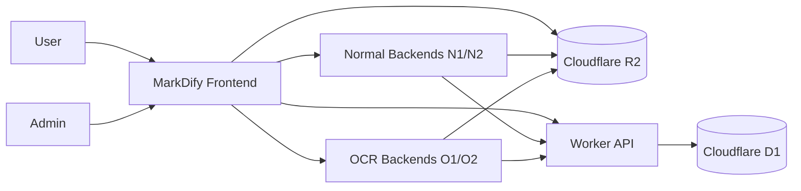
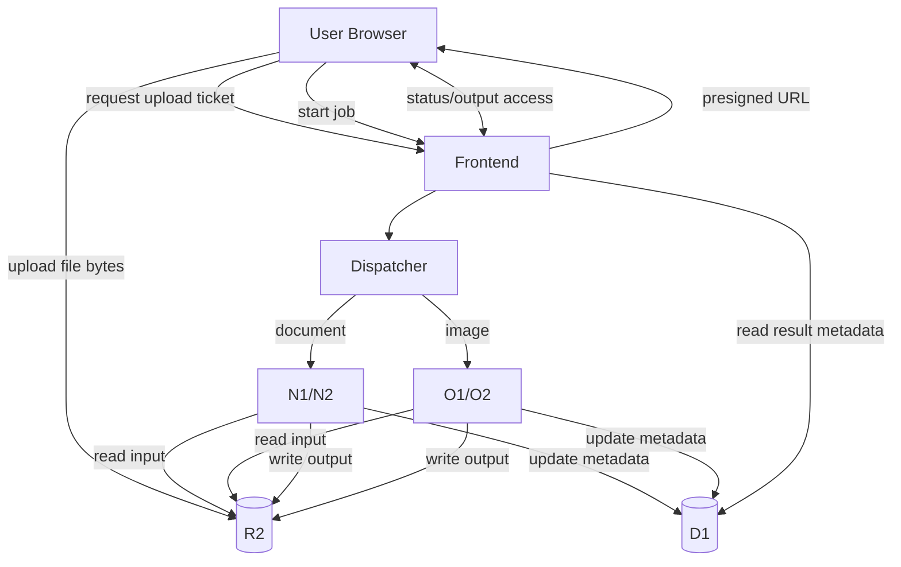
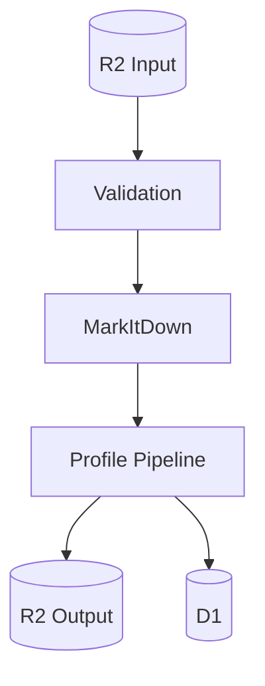
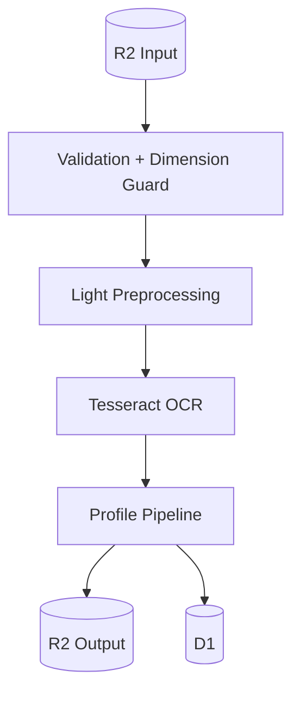
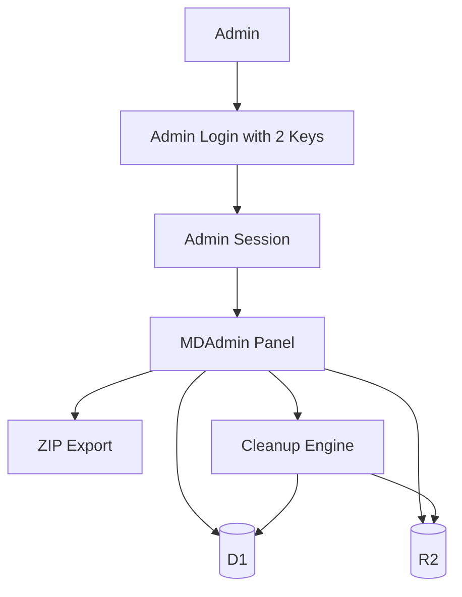
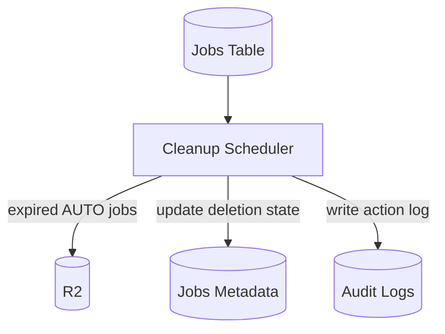
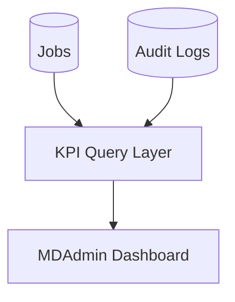

# MarkDify — Data Flow Diagrams (DFD)

This document contains logical data-flow views for MarkDify.

---

## 1. Context-Level DFD

---

## 2. Upload and Conversion DFD

---

## 3. Normal Document Conversion DFD

---

## 4. OCR Conversion DFD

---

## 5. Admin /mdify-controller DFD

---

## 6. Retention and Cleanup DFD

---

## 7. KPI DFD

---

## 8. Suggested Core KPI Blocks

The dashboard should expose at least:

- Today's jobs
- Total jobs
- Processing jobs
- Failed jobs
- Normal jobs today
- OCR jobs today
- Total input files
- Total output files
- R2 storage used
- Jobs expiring in 6h / 24h
- Indefinite KEEP jobs
- Average processing time
- Error rate
- N1/N2/O1/O2 distribution
