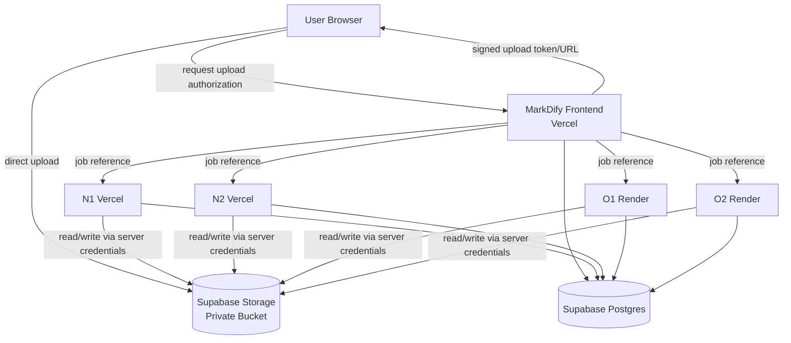

# MarkDify — Supabase Storage Architecture

**Provider:** Supabase Storage  
**Protocol:** Supabase Storage API + TUS + S3-compatible API  
**Bucket:** Private  
**Purpose:** Full storage of MarkDify input and output files

---

# 1. Decision

MarkDify will use **Supabase Storage** instead of Cloudflare R2.

Supabase Storage is S3-compatible, so the Vercel and Render processing backends can continue using familiar S3-compatible clients where useful.

The browser must never receive permanent S3 credentials.

---

# 2. Final Storage Topology



---

# 3. Bucket Design

Use one private application bucket initially:

```text
markdify-files
```

Do not expose the bucket publicly.

Suggested object structure:

```text
markdify-files/
└── jobs/
    └── <job_id>/
        ├── input/
        │   └── source.<ext>
        ├── output/
        │   └── result.md
        └── exports/
            └── <export_id>.zip
```

## Why not use original filenames in object paths?

Avoid placing potentially sensitive user filenames into permanent object paths.

Instead:

```text
object key:
jobs/<job_id>/input/source.pdf

database metadata:
original_filename = "Quarterly Results John Doe.pdf"
```

The metadata can later be removed or anonymized without renaming the physical object.

---

# 4. Upload Strategy

MarkDify's browser should upload directly to Supabase Storage.

Do not proxy large file bodies through Vercel functions.

## Small files

For small files, a signed standard upload is acceptable.

## Larger files

For files above roughly 6 MB, prefer **TUS resumable uploads**.

Recommended flow:

```text
Browser
  ↓
POST /api/uploads/create
  ↓
Vercel server validates metadata
  ↓
Server creates:
- job_id
- object path
- signed upload authorization
  ↓
Browser uploads directly to Supabase Storage
  ↓
Browser confirms upload
  ↓
POST /api/jobs/<job_id>/start
```

This keeps Vercel request bodies small and makes uploads more resilient.

---

# 5. Signed Upload Flow

Suggested API:

```http
POST /api/uploads/create
```

Request:

```json
{
  "filename": "report.pdf",
  "size": 7340032,
  "content_type": "application/pdf"
}
```

Server:

1. validates extension
2. validates declared size
3. generates `job_id`
4. creates deterministic storage path
5. creates initial Postgres job row
6. creates signed upload authorization
7. returns upload details

Example response:

```json
{
  "job_id": "6eb7...",
  "bucket": "markdify-files",
  "object_path": "jobs/6eb7.../input/source.pdf",
  "upload_mode": "tus",
  "upload_token": "...",
  "expires_at": "..."
}
```

The exact response shape should match the Supabase client/library used by the repository.

---

# 6. Server-Side S3 Access

N1, N2, O1, and O2 may use Supabase's S3-compatible endpoint.

Use S3 credentials **only on trusted servers**.

Never place these variables in browser-exposed environment variables.

Suggested variables:

```env
SUPABASE_STORAGE_BUCKET=markdify-files

SUPABASE_S3_ENDPOINT=
SUPABASE_S3_REGION=
SUPABASE_S3_ACCESS_KEY_ID=
SUPABASE_S3_SECRET_ACCESS_KEY=
```

S3 access keys have broad storage privileges and must remain server-only.

For application metadata/database access, use separate Supabase server credentials.

---

# 7. Storage Provider Interface

Do not couple conversion code directly to one SDK.

Preserve or introduce:

```python
class StorageProvider:
    create_upload_authorization(...)
    head_object(...)
    download_to_file(...)
    upload_file(...)
    delete_object(...)
    delete_prefix(...)
    create_download_url(...)
    list_job_objects(...)
```

Implementation:

```text
SupabaseStorageProvider
```

This allows provider replacement without rewriting conversion services.

---

# 8. Processing Backend File Flow

Normal/OCR backends receive only a job reference.

Example:

```json
{
  "job_id": "...",
  "input_object_path": "jobs/.../input/source.pdf",
  "profile": "rag_ready"
}
```

Backend:

```text
Supabase Storage
      ↓
download source
      ↓
validate actual bytes
      ↓
process
      ↓
write output
      ↓
Supabase Storage
```

The source object must be revalidated after download.

A successful upload is not proof that the object is safe.

---

# 9. Input and Output Persistence

For every successful upload:

```text
INPUT:
jobs/<job_id>/input/source.<ext>
```

For every successful conversion:

```text
OUTPUT:
jobs/<job_id>/output/result.md
```

Optional generated exports:

```text
jobs/<job_id>/exports/<export_id>.zip
```

Every object must also have a corresponding row in:

```text
file_objects
```

This gives MDAdmin an application-owned inventory instead of depending entirely on raw storage listings.

---

# 10. file_objects Metadata Contract

Each object should record:

```text
file_id
job_id
bucket
object_path
kind
original_filename
extension
mime_type
size_bytes
etag/checksum if available
storage_status
created_at
uploaded_at
deleted_at
```

Kinds:

```text
INPUT
OUTPUT
EXPORT
PREVIEW
```

Statuses:

```text
PENDING
ACTIVE
DELETE_PENDING
DELETED
ERROR
```

---

# 11. Download Architecture

The bucket remains private.

When the user/admin needs a file:

```text
Browser
  ↓
MarkDify server
  ↓
authorization check
  ↓
short-lived signed URL
  ↓
Browser downloads directly from Supabase Storage
```

Do not proxy large downloads through Vercel unless technically required.

Suggested signed download lifetime:

```text
5–15 minutes
```

Choose a value that matches actual UX.

---

# 12. RLS and Access Control

The browser should not get broad bucket access.

Storage access should be controlled with:

- private bucket
- Row Level Security policies
- signed upload/download authorization
- server-only service credentials

The service role or S3 server credentials must never appear in a `NEXT_PUBLIC_*` variable.

---

# 13. Storage Security Rules

Backend must continue to enforce:

- allowed extension
- maximum source size
- filename sanitation
- magic-byte/content verification
- ZIP-bomb guard
- decoded image dimension limits
- converter support

For OCR:

```text
compressed file size != decoded memory size
```

Dimension/megapixel limits remain mandatory.

---

# 14. Overwrite Policy

Prefer immutable object paths.

Do not use overwrite/upsert unnecessarily.

Recommended:

```text
new job_id = new storage path
```

This prevents stale CDN/object results and avoids accidental replacement.

For retries of the **same** job:

```text
output/result.md
```

may be idempotently replaced if the implementation explicitly handles it.

---

# 15. S3 Versioning Warning

Do not design recovery around S3 object versioning.

Treat physical deletion as permanent.

Therefore:

- admin DELETE actions require confirmation
- audit deletion before/after execution
- KEEP/EXTEND controls must be clear

---

# 16. Multi-File ZIP Export

Small export:

```text
selected files
→ server/export worker
→ ZIP
→ Supabase Storage
→ signed download URL
```

For larger selections, do not build a large ZIP entirely inside a synchronous browser request.

Use an export job:

```text
EXPORT_QUEUED
→ EXPORT_PROCESSING
→ ZIP stored
→ EXPORT_READY
```

The ZIP can use:

```text
jobs/<job_id>/exports/
```

or a dedicated export prefix.

---

# 17. Storage KPIs

MDAdmin should obtain storage KPIs from `file_objects`, including:

```text
active input files
active output files
active exports
total active bytes
input bytes
output bytes
export bytes
files expiring soon
files marked KEEP
deletion errors
```

Use actual Storage API checks for reconciliation, not for every dashboard refresh.

---

# 18. Storage Reconciliation

A periodic reconciliation tool should detect:

```text
database row exists, object missing
object exists, database row missing
size mismatch
job marked deleted, objects still exist
```

Admin actions:

```text
SCAN
REPAIR METADATA
DELETE ORPHAN
RETRY DELETE
```

Reconciliation should be explicit and auditable.

---

# 19. Retention

Default policy:

```text
AUTO
```

Files become eligible for deletion:

```text
upload_completed_at + 48 hours
```

Do not physically delete files while a job is:

```text
UPLOADING
QUEUED
PROCESSING
```

Admin may:

```text
KEEP
EXTEND
DELETE_NOW
```

Full retention design is in `SUPABASE_RETENTION_CLEANUP.md`.

---

# 20. Storage Definition of Done

- [ ] private Supabase bucket exists
- [ ] direct browser upload works
- [ ] >6 MB resumable upload path works
- [ ] N1 can read/write
- [ ] N2 can read/write
- [ ] O1 can read/write
- [ ] O2 can read/write
- [ ] signed download works
- [ ] anonymous direct access fails
- [ ] `file_objects` metadata stays synchronized
- [ ] automatic cleanup works
- [ ] KEEP/EXTEND works
- [ ] orphan scan works
- [ ] admin bulk deletion works
