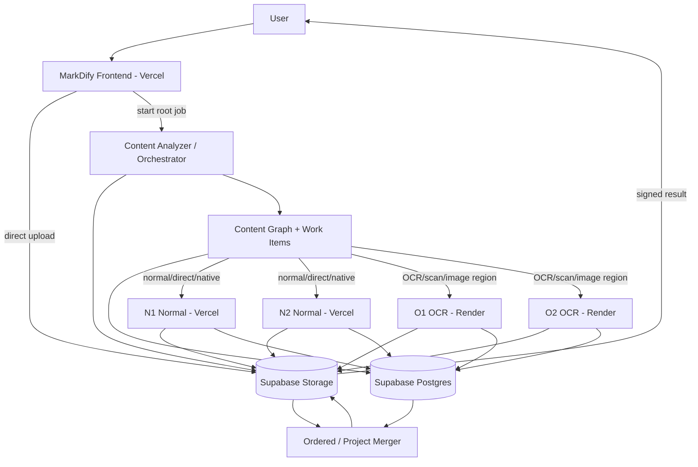

# MarkDify — Unified Content-Aware Conversion Architecture

**Product:** MarkDify  
**Frontend:** Vercel  
**Normal Pool:** N1 + N2 on Vercel  
**OCR Pool:** O1 + O2 on Render  
**Storage:** Supabase Storage  
**Database:** Supabase Postgres  
**Admin:** `/mdify-controller`

---

## 1. Goal

MarkDify must stop routing only by file extension.

It should understand the structure inside a file, break complex content into safe processing units, route each unit to the right backend, process independent units in parallel, and merge the results back into one useful user-facing output.

This architecture unifies:

- hybrid PDFs containing native text, screenshots, scans, and image-only pages;
- complex ZIP/project archives containing code, documents, images, nested archives, and unsupported binaries.

---

## 2. Unified architecture



---

## 3. Key concept: Unified Content Graph

Both PDFs and ZIPs become a tree of logical content nodes.

Example PDF:

```text
ROOT annual-report.pdf
├── Page 1 → NATIVE_TEXT
├── Page 2 → MIXED
│   ├── Native text
│   └── Image region → OCR
├── Page 3 → IMAGE_ONLY
└── Page 4 → NATIVE_TEXT
```

Example ZIP:

```text
ROOT project.zip
├── README.md
├── src/
│   ├── app.ts
│   └── logo.png
└── docs/
    └── manual.pdf
        ├── Page 1
        ├── Page 2
        └── Page 3
```

The same processing pattern applies:

```text
Source
→ Analyze
→ Build content nodes
→ Create work items
→ Dispatch to correct pool
→ Merge logical results
→ Store outputs
```

---

## 4. Core database model

Keep:

```text
jobs
file_objects
job_events
audit_logs
```

Add:

```text
content_nodes
work_items
```

### jobs

One top-level user upload.

Important fields:

```text
job_id
source_type
status
profile
total_nodes
completed_nodes
failed_nodes
skipped_nodes
normal_nodes
ocr_nodes
archive_nodes
pdf_pages
created_at
started_at
completed_at
retention_mode
auto_delete_at
processing_ms
total_ms
```

### content_nodes

Recommended fields:

```text
node_id
job_id
parent_node_id
node_type
classification
logical_path
relative_path
page_number
region_index
archive_depth
sequence_index
source_object_path
output_object_path
status
skip_reason
metadata JSONB
created_at
completed_at
```

Node types:

```text
ROOT_FILE
ARCHIVE_ENTRY
DIRECTORY
PDF_PAGE
PDF_IMAGE_REGION
TEXT_FILE
CODE_FILE
DOCUMENT
IMAGE
NESTED_ARCHIVE
BINARY
```

Classifications:

```text
DIRECT_TEXT
NORMAL_DOCUMENT
PDF_NATIVE
PDF_MIXED
PDF_OCR
OCR_IMAGE
ARCHIVE
SKIP
UNSUPPORTED
```

### work_items

Durable processing units:

```text
work_item_id
job_id
node_id
task_type
pool
status
priority
sequence_index
assigned_backend
attempt_count
max_attempts
claimed_at
started_at
completed_at
input_reference
output_reference
error_code
error_message
created_at
updated_at
```

Task types:

```text
ARCHIVE_INSPECT
DIRECT_EXTRACT
DOCUMENT_CONVERT
PDF_ANALYZE
PDF_NATIVE_EXTRACT
PDF_MIXED_OCR_REGION
PDF_PAGE_OCR
IMAGE_OCR
PROJECT_MERGE
PDF_MERGE
EXPORT_ZIP
```

---

## 5. Durable scheduling

Do not keep the queue only in memory.

Use Supabase Postgres as the durable source of work state.

```text
work_items
→ atomic claim
→ bounded dispatcher tick
→ N1/N2/O1/O2
```

Use transaction-safe claiming such as:

```text
FOR UPDATE SKIP LOCKED
```

The orchestrator should be stateless.

Do not keep a single Vercel request open for the entire lifetime of a large ZIP.

Recommended orchestration pattern:

```text
root created
→ analyzer creates work
→ dispatcher sends bounded first wave
→ child finishes
→ child updates DB
→ completion schedules next dispatcher tick
→ next bounded wave
→ all children terminal
→ merger becomes eligible
```

---

## 6. Backpressure and fairness

Never launch all child tasks at once.

Use measured configuration:

```text
MAX_INFLIGHT_NORMAL
MAX_INFLIGHT_OCR
MAX_CHILDREN_PER_ROOT
MAX_ROOTS_INFLIGHT
```

Do not finalize these numbers before load testing.

All four backends should be able to work concurrently:

```text
N1
N2
O1
O2
```

but one giant archive should not monopolize the entire system.

Use fair scheduling across root jobs.

---

# 7. Hybrid PDF architecture

```text
PDF uploaded
    ↓
PDF Analyzer
    ↓
Inspect each page
    ↓
┌─────────────────┬─────────────────┬─────────────────┐
│ Native Text     │ Mixed Content   │ Image / Scan    │
│                 │                 │                 │
│ N1/N2           │ Hybrid          │ O1/O2           │
│ native extract  │ extraction      │ OCR             │
└────────┬────────┴────────┬────────┴────────┬────────┘
         │                 │                 │
         └─────────────────┼─────────────────┘
                           ↓
                    Ordered Merger
                           ↓
                      result.md
                           ↓
                  Supabase Storage
```

---

## 8. PDF Analyzer

Inspect each page before selecting a processing path.

Collect:

```text
native text character count
text blocks
image objects
image bounding boxes
image coverage ratio
page dimensions
page order
```

Suggested page classes:

```text
NATIVE_TEXT
MIXED
IMAGE_ONLY
EMPTY
UNSUPPORTED
```

Do not treat all `.pdf` files as normal text PDFs.

---

## 9. Native PDF page

```text
page
→ native extraction
→ N1/N2
```

Do not OCR machine-readable text unnecessarily.

---

## 10. Image-only/scanned PDF page

```text
page
→ PDF_OCR work item
→ O1/O2
→ render only requested page
→ orientation correction
→ resize/downscale
→ grayscale
→ Tesseract
```

Do not render all PDF pages in advance.

Process OCR-required pages one at a time.

---

## 11. Mixed PDF page

For pages containing native text plus raster images:

```text
native text → N1/N2
candidate text-bearing image regions → O1/O2
→ conservative deduplication
→ position-aware merge
```

Do not OCR the entire page by default if that duplicates machine-readable text.

---

## 12. Candidate image filtering

Do not OCR every logo/icon.

Candidate filtering can consider:

```text
minimum pixel dimensions
page-area ratio
image dimensions
decorative-image heuristics
text-like characteristics
```

Keep thresholds configurable and benchmarked.

---

## 13. PDF OCR orientation

Required regression cases:

```text
0°
90°
180°
270°
```

Pipeline:

```text
render/extract
→ detect orientation
→ rotate upright
→ downscale if needed
→ grayscale
→ OCR
```

The previously observed 90° OCR failure must remain a permanent regression test.

---

## 14. Ordered PDF merger

Every result carries:

```text
page_number
sequence_index
source type
```

Merge in original order.

For mixed pages, combine native and OCR content conservatively.

Do not aggressively deduplicate legitimate repeated text.

---

# 15. ZIP / Project architecture

```text
ZIP
 ↓
Safe Archive Inspector
 ↓
Directory Tree
 ↓
Recursive File Classifier
 ↓
┌─────────────┬───────────────┬──────────────┬───────────────┐
│ Code/Text   │ Documents     │ Images       │ Nested ZIP    │
│             │               │              │               │
│ direct      │ N1/N2         │ O1/O2        │ recurse       │
│ extraction  │ MarkItDown    │ OCR          │ safely        │
└──────┬──────┴──────┬────────┴──────┬───────┴──────┬────────┘
       │             │               │              │
       └─────────────┴───────────────┴──────────────┘
                          ↓
                     Project Merger
                          ↓
                  Supabase Storage
```

---

## 16. Safe Archive Inspector

Inspect archive metadata before extracting everything.

Validate:

```text
entry count
compressed size
uncompressed size
compression ratio
entry paths
nested depth
nested archive count
encrypted entries
symlinks
absolute paths
path traversal
duplicate paths
```

Configurable safety limits:

```text
MAX_ARCHIVE_DEPTH
MAX_ARCHIVE_ENTRIES
MAX_ARCHIVE_UNCOMPRESSED_BYTES
MAX_ENTRY_UNCOMPRESSED_BYTES
MAX_COMPRESSION_RATIO
MAX_NESTED_ARCHIVES
```

If a limit is hit:

```text
mark node SKIPPED
record reason
surface it in PROJECT_INDEX.md
```

Do not silently drop content.

---

## 17. Archive path security

Block:

```text
../
../../
absolute Unix paths
Windows drive paths
unsafe symlinks
```

Normalize paths before extraction.

Do not allow entries to escape the extraction root.

---

## 18. Recursive classifier

Classes:

```text
CODE_TEXT
DOCUMENT
PDF
IMAGE
NESTED_ARCHIVE
BINARY
UNSUPPORTED
DIRECTORY
```

Routing:

```text
CODE_TEXT      → DirectTextExtractor
DOCUMENT       → MarkItDown
PDF            → Hybrid PDF pipeline
IMAGE          → OCR
NESTED_ARCHIVE → recurse safely
BINARY         → index only
UNSUPPORTED    → index only / skip reason
```

---

## 19. Code/text preservation

Do not convert code into prose.

Example:

````markdown
# src/app.ts

```typescript
export function run() {
  ...
}
```
````

Preserve path, language, and source order.

---

## 20. Smart project mode

Common large generated/dependency directories:

```text
node_modules
.git
dist
build
vendor
.venv
__pycache__
coverage
```

Recommended product behavior:

### Smart Project Mode — default

Index these directories but skip their contents by default.

### Full Project Mode

Attempt supported files subject to archive safety limits.

If no new UI setting is desired yet, keep this server-configurable until UX is finalized.

Do not silently discard them.

---

## 21. Nested archives

```text
nested ZIP
→ depth check
→ safe materialization
→ new archive node
→ inspect
→ classify children
```

Nested archives inherit the same root `job_id`.

Never recurse without limits.

---

## 22. Materialization optimization

Always keep the original uploaded file.

Do not persist every extracted child to Supabase Storage by default.

Materialize child source objects only when distributed processing requires them.

Examples:

```text
small code/text file
→ direct extract inside archive processor
→ no child source object required

image
→ materialize child
→ O1/O2 process it

nested ZIP
→ materialize nested archive
→ recursive analyzer processes it
```

This reduces Storage duplication and network transfer.

---

## 23. Project outputs

A complex archive should produce:

```text
PROJECT_INDEX.md
manifest.json
converted-project.zip
combined.md           # when reasonably sized
```

For large projects:

```text
combined/
├── part-001.md
├── part-002.md
└── ...
```

Never return giant Markdown results inline.

---

## 24. PROJECT_INDEX.md

Should include:

```text
summary
tree
per-file status
engine used
warnings
skipped files
failed files
nested archive status
```

Example:

```markdown
# Project Conversion

## Summary

- Files found: 87
- Converted: 80
- OCR: 12
- Skipped: 5
- Failed: 2

## Tree

project/
├── README.md
├── src/
│   ├── app.ts
│   └── logo.png
└── docs/
    └── manual.pdf

## Results

| Path | Type | Status | Engine |
|---|---|---|---|
| README.md | Markdown | Converted | Direct |
| src/app.ts | TypeScript | Converted | Direct |
| src/logo.png | Image | Converted | OCR |
| docs/manual.pdf | PDF | Converted | Hybrid PDF |
```

---

## 25. manifest.json

Machine-readable manifest should include:

```text
root job ID
source metadata
content tree
node IDs
logical paths
classification
processing engine
backend
status
output path
warnings
errors
timings
```

Useful for:

```text
RAG ingestion
API consumers
admin inspection
reprocessing
debugging
```

---

## 26. Project merger

The merger must be deterministic.

Use logical directory/path order.

Do not invent text for binary files.

For very large outputs, stream merger output to Storage instead of constructing the whole result in RAM.

Merge once after child processing reaches terminal state.

Do not rebuild combined output after every child completes.

---

# 27. Supabase Storage layout

```text
jobs/<job_id>/
├── input/
│   └── source.<ext>
├── materialized/
│   └── <node_id>/
│       └── source.<ext>
├── nodes/
│   └── <node_id>/
│       └── result.md
├── output/
│   ├── result.md
│   ├── PROJECT_INDEX.md
│   ├── manifest.json
│   └── combined/
│       ├── part-001.md
│       └── ...
└── exports/
    └── converted-project.zip
```

Not every job needs every directory.

---

## 28. Retention

All root and materialized files inherit:

```text
AUTO → 48 hours
KEEP
EXTEND
DELETE_NOW
```

Root cleanup must remove:

```text
original input
materialized child objects
node outputs
final outputs
exports
```

Cleanup must be idempotent.

---

# 29. API result contract

Do not return huge converted content inline.

Example:

```json
{
  "job_id": "uuid",
  "status": "COMPLETED",
  "source_type": "ARCHIVE",
  "summary": {
    "nodes": 87,
    "converted": 80,
    "ocr": 12,
    "skipped": 5,
    "failed": 2
  },
  "outputs": {
    "index": "jobs/.../output/PROJECT_INDEX.md",
    "manifest": "jobs/.../output/manifest.json",
    "bundle": "jobs/.../exports/converted-project.zip"
  }
}
```

The frontend obtains signed URLs when needed.

---

# 30. User progress model

Do not write progress every second.

Use meaningful states.

PDF:

```text
Analyzing pages
Processing native content
OCR processing
Merging
Complete
```

ZIP:

```text
Inspecting archive
Classifying project
Processing files
Building output
Complete
```

Progress can be derived from:

```text
analyzed_nodes / total_nodes
completed_work_items / total_work_items
merge state
```

Throttle database writes.

---

# 31. Backend responsibilities

## N1 / N2

Can handle:

```text
archive inspection
direct text/code extraction
normal document conversion
PDF analysis
native PDF extraction
lightweight merge tasks
```

No Tesseract requirement.

## O1 / O2

Can handle:

```text
image OCR
PDF page OCR
PDF image-region OCR
orientation correction
image preprocessing
```

Use:

```text
Tesseract
tessdata_fast
OMP_THREAD_LIMIT=1
```

Final OCR concurrency must follow measured load tests.

---

# 32. Failure isolation

One failed child should not always fail the entire archive.

Recommended root outcomes:

```text
COMPLETED
COMPLETED_WITH_WARNINGS
FAILED
```

A project can be useful even if some binaries or unsupported files are skipped.

PDF page failures must be surfaced explicitly.

---

## 33. Retry and failover

Retry only transient infrastructure failures.

Normal:

```text
N1 ↔ N2
```

OCR:

```text
O1 ↔ O2
```

Use one bounded peer retry.

Do not retry:

```text
unsafe archive
unsupported binary
invalid file
archive bomb
deterministic parse error
```

---

# 34. Admin `/mdify-controller`

Admin job detail should show the content tree.

Example:

```text
ZIP-001
├── README.md         ✓ Direct / N1
├── src/app.ts        ✓ Direct / N2
├── logo.png          ✓ OCR / O1
└── manual.pdf
    ├── page 1        ✓ Native / N1
    ├── page 2        ✓ Mixed / N2 + O2
    └── page 3        ✓ OCR / O1
```

Expose:

```text
classification
status
backend
duration
warnings
errors
output reference
```

Do not show document contents by default.

---

## 35. Additional KPIs

Add:

```text
archive jobs today
hybrid PDF jobs today
nodes processed today
OCR nodes today
average nodes per archive
partial jobs
skipped nodes
nested archives
PDF OCR-page ratio
```

---

# 36. Optimization strategy

Optimize in this order:

```text
1. avoid unnecessary work
2. avoid unnecessary OCR
3. avoid unnecessary Storage materialization
4. bound concurrency
5. parallelize independent units
6. merge once
```

This is more important than blindly increasing worker counts.

---

## 37. Permanent PDF tests

```text
all-native PDF
all-scanned PDF
mixed native + scans
native page with screenshot text
90° scan
180° scan
270° scan
empty page
150-page PDF
```

---

## 38. Permanent ZIP tests

```text
simple project
deep folders
code + docs + images
nested ZIP
PDF inside ZIP
unsupported binaries
large text
20k-row XLSX inside ZIP
malformed ZIP
path traversal ZIP
high compression ratio ZIP
oversized entry
excessive nesting
mixed-success project
```

---

## 39. Parallelism test

One root project should be able to create simultaneous work:

```text
README.md   → N1
manual.docx → N2
diagram.png → O1
scan.jpg    → O2
```

Measure:

```text
parallel makespan
per-item latency
contention penalty
throughput
backend distribution
```

Do not assume four backends equal four-times throughput.

---

# 40. Production readiness gates

Hybrid PDF is not production-ready until:

- [ ] native page extraction works
- [ ] scanned-page OCR works
- [ ] mixed page processing works
- [ ] 90/180/270 rotation works
- [ ] ordered merge works
- [ ] duplicate text is controlled
- [ ] 150-page PDF passes

Archive conversion is not production-ready until:

- [ ] archive bomb protection passes
- [ ] path traversal protection passes
- [ ] nesting limits pass
- [ ] bounded scheduling works
- [ ] partial-result UX works
- [ ] deterministic project merge works
- [ ] large outputs use Storage

---

# 41. Implementation order

### Phase 1
Add `content_nodes` and `work_items`.

### Phase 2
Build atomic claiming, fair scheduling, bounded dispatch, and completion-triggered dispatcher ticks.

### Phase 3
Implement hybrid PDF analyzer, native/OCR/mixed paths, and ordered merger.

### Phase 4
Implement safe archive inspector, recursive classifier, nested archive handling, materialization policy, and project merger.

### Phase 5
Build `PROJECT_INDEX.md`, `manifest.json`, converted project ZIP, and segmented combined outputs.

### Phase 6
Add tree/process visibility to `/mdify-controller`.

### Phase 7
Run security, performance, failover, parallelism, and load suites.

---

# 42. Final architecture summary

```text
                         USER
                           │
                           ▼
                    Vercel Frontend
                           │
                           ▼
                    Supabase Storage
                           │
                           ▼
                  Root Content Analyzer
                           │
                           ▼
                   Unified Content Graph
                           │
                 ┌─────────┴─────────┐
                 │                   │
                 ▼                   ▼
            PDF Analyzer        Archive Inspector
                 │                   │
      ┌──────────┼──────────┐        ▼
      │          │          │   Recursive Classifier
      ▼          ▼          ▼        │
   Native      Mixed       Scan       ├── Code/Text
      │          │          │        ├── Documents
      │          │          │        ├── Images
      │          │          │        └── Nested ZIP
      └──────┬───┴─────┬────┘              │
             ▼         ▼                   ▼
          N1 / N2    O1 / O2       Bounded Work Graph
             │         │                   │
             └────┬────┘                   │
                  └──────────┬─────────────┘
                             ▼
                   Ordered / Project Merger
                             │
                             ▼
                     Supabase Storage
                             │
              ┌──────────────┼──────────────┐
              ▼              ▼              ▼
          result.md    PROJECT_INDEX.md   bundle.zip
```

## Final principle

**Analyze first, process only what is necessary, parallelize independent work within measured limits, preserve the user's logical structure, and return structured Storage-backed results rather than treating every upload as one flat file.**
